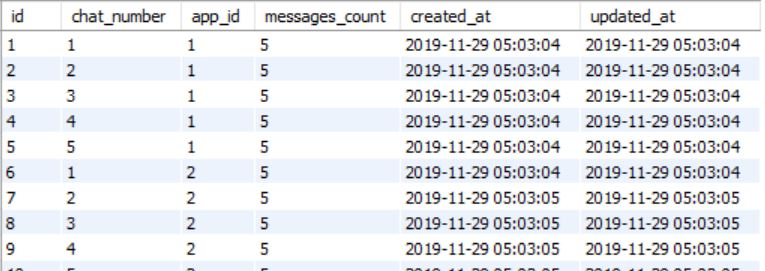

# README

## Requirements

* Docker
* Your favorite API test tool, Postman is great

## Usage

1. Make sure ```docker``` and ```docker-compose``` are installed
2. Clone repository
3. Run the following commands in terminal

```
$ docker-compose build
```

This builds the docker containers needed.

Namely they are **3 main docker containers**:

1. The Rails app
2. The Database app (in form of mysql container)
3. The ElasticSearch app

*Note: If you are using a fresh docker installation, fetching the resources will download around half a gigabyte (mainly the ElasticSearch and the Rails libraries)*
*If you alreay have specific versions installed, you can choose to change the versions used. (in the files ```Dockerfile``` and ```Gemfile```)*

Then to run the application

```
$ docker-compose up -d
```

**AND NOW YOU'RE READY!**

## API Description

If settings kept as default, rails server will run on http://localhost:3000/ and hence append that with the paths in the table below.

| Action                                                                   | HTTP Verb | Path                                                                        | Parameters                                                                        | Response                                                |
|--------------------------------------------------------------------------|-----------|-----------------------------------------------------------------------------|-----------------------------------------------------------------------------------|---------------------------------------------------------|
| Get a token for a new application                                        | POST      | /applications/create/?name=:name                                            | :name                                                                             | {:token, :name,:created_at}                             |
| Get number of chats under an application                                 | GET       | /applications/:app_token/chats/count                                        | :app_token                                                                        | {:chats_count}                                          |
| Delete an application by its token                                       | DELETE    | /applications/:app_token/delete                                             | :app_token                                                                        | Status message about action completion/fail             |
| Create a new chat under an application                                   | POST      | /applications/:app_token/chats/create                                       | :app_token                                                                        | {:chat_number, :created_at}                             |
| Get list of all chats under an application                               | GET       | /applications/:app_token/chats/get                                          | :app_token                                                                        | [{:chat_number, :created_at}]                           |
| Get number of messages under an application                              | GET       | /applications/:app_token/chats/:chat_number/messages/count                  | :app_token, :chat_number                                                          | {:messages_count}                                       |
| Delete a specific chat                                                   | DELETE    | /applications/:app_token/chats/:chat_number/delete                          | :app_token, :chat_number                                                          | Status message about action completion/fail             |
| Create a new message                                                     | POST      | /applications/:app_token/chats/:chat_number/messages/create                 | :app_token, :chat_number, AND :content of message in body of POST                 | {:message_number, :content, :created_at, :updated_at}   |
| Get all messages under a specific chat                                   | GET       | /applications/:app_token/chats/:chat_number/messages/get                    | :app_token, :chat_number                                                          | [{:message_number, :content, :created_at, :updated_at}] |
| Get details about a specific message                                     | GET       | /applications/:app_token/chats/:chat_number/messages/:message_number/get    | :app_token, :chat_number, :message_number                                         | {:message_number, :content, :created_at, :updated_at}   |
| Update a specific message                                                | PUT       | /applications/:app_token/chats/:chat_number/messages/:message_number/update | :app_token, :chat_number, :message_number, AND :content of message in body of PUT | {:message_number, :content, :created_at, :updated_at}   |
| Delete a specific message                                                | DELETE    | /applications/:app_token/chats/:chat_number/messages/:message_number/delete | :app_token, :chat_number, :message_number                                         | Status message about action completion/fail             |
| Search (by partial matching the contents of messages of a specific chat) | GET       | /applications/:app_token/chats/:chat_number/search/?query=:query            | :app_token, :chat_number                                                          | {"results":[:message_number, :content]}                 |
| Redirect to Rails root page                                              | GET       | any other path entered                                                      | -                                                                                 | -                                                       |

## More detailed specifications

To be found in the file ```code_specs.pdf``` in the repo

## Sample Data

You can use the task rails ```db:seed``` to input the following sample data into the DB. (Do that after you are completely done with starting the server)

**Applications Seed Data**


**Chats Seed Data**



**Messages Seed Data**


